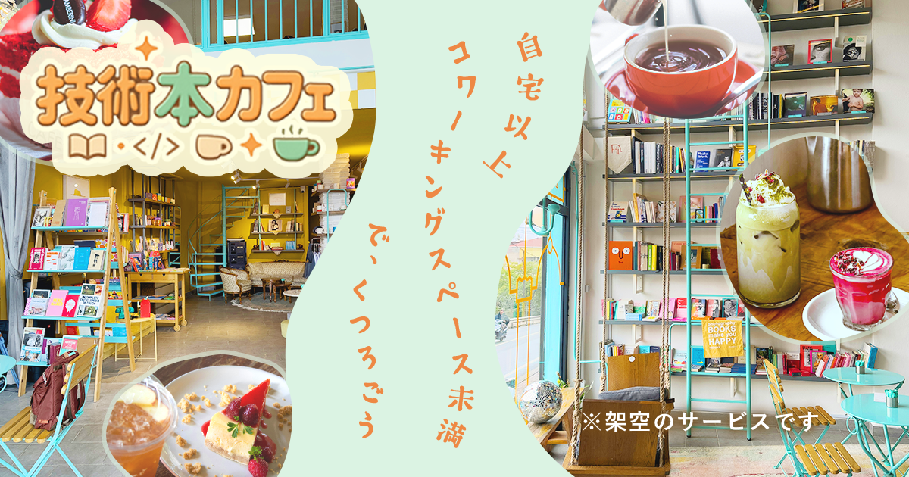

# [技術本カフェ（架空サイト）](https://pakira56acoding.vercel.app/)
<a href="https://pakira56acoding.vercel.app/">
  
</a>

こちらはSHElikesの講座「Webサイト制作コーディング編」の実技試験で制作したサイトです。
96点で合格できました
- URL
  ```markdown
  https://pakira56acoding.vercel.app
  ```


# サイトの内容を決めた経緯
未経験でエンジニア転職をしましたが、転職後の学習が続かないときがありました。  
在宅勤務だったこともあり、家での学習はなんだか億劫で手につかず。  
かといってコワーキングスペースに行くのも、お金がかかるので通いずらかったです。  
そして、技術本はどれも高いです。  
　
先輩エンジニアが不要になった技術本を寄付し、`読み放題にしてくれたカフェが存在すれば通ったかもなぁ`と思い制作しました。  
マーケティング的には、狭くて展開しにくいブックカフェかもですが  
LPを作る分には楽しいかなと思いました。  
____
# サイトの目的・内容
- エンジニアが、気軽に技術本を読みにこれるカフェだと認識し・来店してもらう
- 非エンジニアのカフェユーザーにも来店してもらう
____
# ターゲット
**エンジニア**
- 20~40代
- 高い技術本を、安く読みたい人
- 読んだ感想をシェアしあいたい人
- 技術のカテゴリーは問わず、幅広く学習したい人
- 自宅以外で、気軽にリラックスできる学習空間が欲しい人

**非エンジニア**
- 20~40代
- プログラミングではなくても、リラックスして学習ができるカフェ
- 学習目的ではなくても、利用できるカフェ  
____
# ワイヤーフレームとデザインカンプ
⚠️：ひとまずスクショを貼ってます（後日高画質を貼り替える予定です）
|ワイヤーフレーム|デザインカンプ|
|:--:|:--:|
|||
____
# こだわりポイント・工夫したポイント
以前、**「WEBサイト制作デザイン編」の実技試験（デザインカンプ作成）で提出したこだわりポイント・工夫したポイント**
- 気軽に入店できるようにした工夫
  - 開放感がある店内の写真選び
  - パソコンが映ってない写真選び（堅苦しい雰囲気を削減）
  - 「自宅以上　コワーキングスペース未満で、くつろごう」というキャッチコピー
  - ゆるゆるとした輪郭の写真、コピー、ボタン
- リラックスできるようにした工夫
  - 薄いグリーンと優しいオレンジをチョイスしました

- エンジニアやプログラミングの要素
  - 「技術本カフェ」というサイト名
  - コピーに「コワーキングスペース」という単語を入れ、PC操作ができる空間であると認識してもらう
  - コンセプト欄の「技術本って高いですよね〜」
  - 画面両端にあるアイコン達
  - 学習していて、最初は「楽しそう〜」と気軽に着手し、だんだん集中していく様子を
    画面下部につれてゆるさが抜けていくような構成にしました

　
　
今回、**「WEBサイト制作コーディング編」の実技試験（実装）でこだわりポイント・工夫したポイント**

- 「よくある質問」セクションを新たに設け、非エンジニアであっても大歓迎と記載した
- 「viewmore」ボタンは、ゆるやかな形を保っておきたかったので画像として扱いました。
- スクロールやハンバーガーメニューの挙動は、少し「ふわっ」と表示させ緩やかな世界観を表現しました。
- メインビジュアルは見切れやすいので最大幅1920px、768px、440pxの３枚を用意しました。
- 極力デザインカンプと同じように作成しましたが、「NEWS」セクションはスライダーに変更してます。  
  （デザインカンプもスライダーに変更すべきかTAさんに相談しましたが、そんなに大きく変わってないので不要と言ってもらいました）
- 全体的位に、押下できる要素はホバー時のアクションを大きめに見せ、PCで操作する時楽しくなるようにしました。
- SNSのアイコンは、https://icons8.jp/ というサイトからダウンロードしてます
- 画面両端にプログラミングに関するアイコンを固定で配置し、エンジニア気分になれます。
- 架空のサイトなので、ボタン押下時はアラートを表示させてます（Xシェアボタンは例外） 
